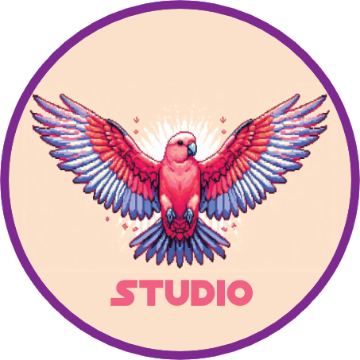

  

<h1 align="center">Pinky Galah Studios</h1>

<em>"We may be small, but we dream in galaxies."</em>

---

**Pinky Galah Studios** is an independent game development studio focused on crafting unique, stylized, and heartfelt gaming experiences.

We are currently in active development of two titles, both made with Unity.

---

## Our Mission

To create imaginative and engaging games that spark curiosity, challenge players, and bring joy to people of all ages. We believe in the power of small teams with big visions.

---

## In Development

### 🚢 Ship Combat Game

> A stylized 3D ship combat game made with Unity.
>
> - Custom ship physics
> - Modular turret and weapon systems
> - Strategic combat and navigation
> - Stylized visuals and handcrafted assets
> - Built with C# and the Unity Engine

### ⚓ Werft-Simulator (Shipyard Simulator)

> A shipyard management & simulation game set in the early 20th century.
>
> - Economic shipyard simulation in the early 1900s
> - Research into hulls, engines, and propulsion
> - Design your own ships and take on construction contracts
> - Workshop atmosphere with freely movable control panels
> - Built with C# and the Unity Engine

Stay tuned for devlogs and playable builds!

---

## Technologies

- Unity Engine (URP)
- C# Scripting
- Blender (3D modeling & animation)
- Git & GitHub for version control
- Visual Studio Code / Rider
- Notion for task management
- Affinity for design & concepts

---

## Team

| Name       | Role                            |
| ---------- | ------------------------------- |
| **Mcbrei** | Founder, Designer, Project Lead |

---

## 📬 Contact

- 📧 Email: <mcbrei@proton.me>
- 🐦 Twitter / X: [@the_mcbrei](https://x.com/the_mcbrei)
- 🕹️ Twitch: [mcbrei](https://www.twitch.tv/mcbrei)
- 🌐 Website: [mcbrei.github.io/pinkygalahstudio](https://mcbrei.github.io/pinkygalahstudio)

---

<em>"We may be small, but we dream in galaxies."</em> — Pinky Galah Studios

